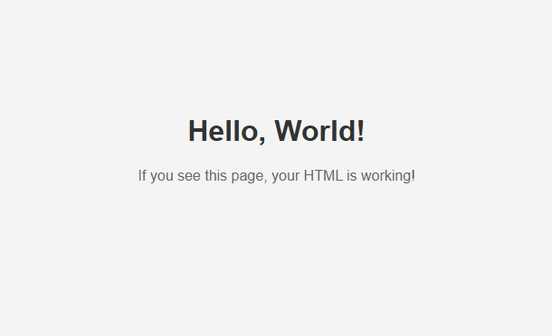

# 🗄️ Simple HTTP Server

A simple HTTP server written in C langauge, implements 400, 404, 405 and 500 response functionality.

## ✨ Features

- Sample HTML index file
- Supports different mime types
- Text response

## 🛠️ Built With

- **Language**: C
- **Build System**: CMake
- **Platform**: Windows

## 📜 Instructions

- Generate project using CMake
- Run the Server, open browser and go to http://localhost:8080
- You should see the Hello, World HTML page loaded successfully
- To terminate the server press CTRL + C  

  

